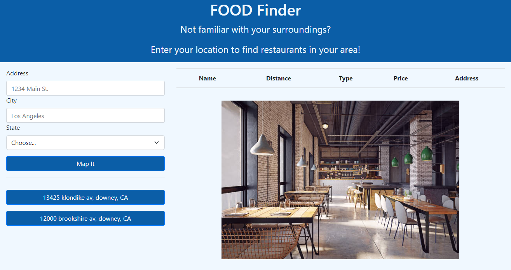

# Foodr

## Description

Provide a short description explaining the what, why, and how of your project. Use the following questions as a guide:

- The motivation for making this project was to create an app that would find restaurants near you when an address is entered. The user will get a list of  of restaurants and may sortby name, address, distance and price.
- the team built this project because it would be useful to use when you are not familiar with an area. Maybe to used on vacation or a new city that you have moved to.
- This solves the problem of not knowing what restaurants are available in the area you are currently visiting.
- We learned that there are many ways to do different things and that communication and teamwork are the most important part when working on a group project. 

## Usage

The user may enter an address and the app will find the 30 restaurants nearest the location of the address entered. The user may sort by name, price, type of restaurant, address and distance.

## Credits

List of collaborators:

- https://github.com/naveed-mahmoudian
- https://github.com/blu3bloodedcod3r
- 

## License

